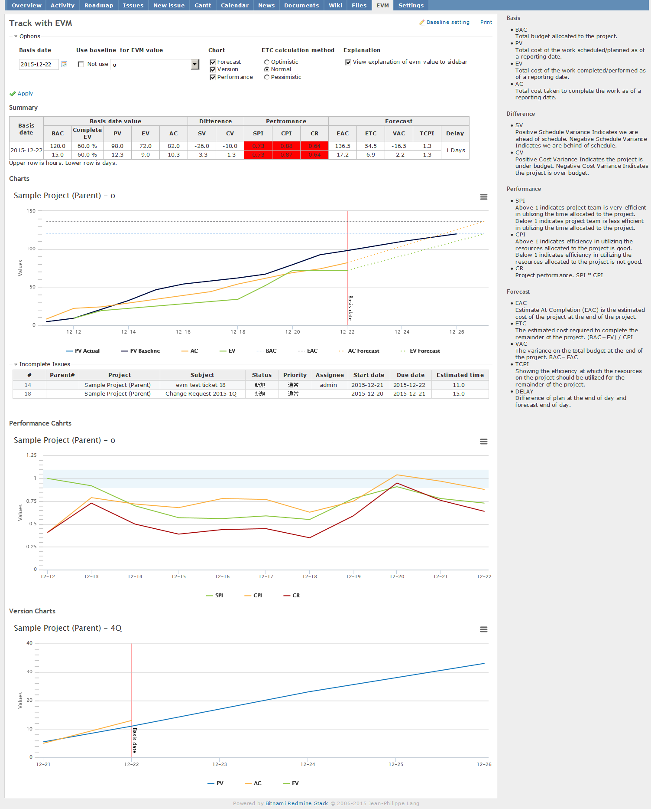

# redmine issue evm

チケットの開始日、期日、予定工数を利用してEVM値の計算とグラフを表示する機能を提供しています。

## バージョン
3.2

## 機能
* EVM値の計算
* EVM値の計算をする基準日の選択
* EVMのグラフ表示
* プロジェクトのパフォーマンス（SPI,CPI）を計算・グラフ表示ができます
* 予測値の計算・グラフ表示
* ベースラインの設定・グラフ表示
* 未完了のチケットを表示

## グラフ表示
グラフ表示はhighcharts 4.0.4を使っています。商用利用の場合は有料なので注意。

## EVM値の計算
計算ロジックは、evm_logic.rbにまとまっています。EVM値を計算したいissueオブジェクト渡すことで計算していますので、流用しやすくなっています。

## 計算に必要なチケットの情報
各チケット毎に以下の情報を使ってEVM値を計算して集計しています。EVMを表示するプロジェクト（子プロジェクト含む）内の、以下の項目に入力があるチケットが計算対象です。
* 開始日
* 期日
* 予定工数(0でも構いませんがPV,EVが計算できないため意味がありません)

## EVM値の計算
開始日、期日の両方が入力されていないチケットは、日毎のPV（予定工数）を計算出来ないため、対象外としてます。
また、親チケットも計算対象外です。最下層の子チケットだけを使ってPV,EVを計算しています。

* PV : 開始日、期日、予定工数を利用して、PVを計算します。日毎の工数を計算しています。
* EV : チケットをCLOSEした日に、予定工数をEVとして計算しています。
* AC : PVの計算に使われているチケットの作業時間を使って、計算しています。

### 計算例
開始日:2015/08/01 期日:2015/08/03 予定工数:30時間のチケットを作成。この時点では、PVのみが有効。PVは日毎のPVから累積値を計算しています。チケットが完了していないので、EVは計算されません。
* PV -> 8/1:10時間 8/2:10時間 8/3:10時間　(30時間を3日で割って日毎のPVを計算)
* EV -> 0
* AC -> 0

| EVM | 8/1 | 8/2 | 8/3 |
| --- | --- | --- | --- |
| PV  | 10  | 20  | 30  |
| EV  | 0   | 0   | 0   |
| AC  | 0   | 0   | 0   |

チケットの作業時間を8/1,8/2,8/3に10時間、6時間、7時間入力する。日毎のPVに対して、ACの累積値が計算されます。
* PV -> 8/1:10時間 8/2:10時間 8/3:10時間
* EV -> 0
* AC -> 8/1:10時間 8/2:6時間 8/3:7時間

| EVM | 8/1 | 8/2 | 8/3 |
| --- | --- | --- | --- |
| PV  | 10  | 20  | 30  |
| EV  | 0   | 0   | 0   |
| AC  | 10  | 16  | 23  |

チケットを8/3にCLOSEする。チケットのクローズした日がEVの計上日になります。
* PV -> 8/1:10時間 8/2:10時間 8/3:10時間
* EV -> 8/3:30時間
* AC -> 8/1:10時間 8/2:6時間 8/3:7時間

| EVM | 8/1 | 8/2 | 8/3 |
| --- | --- | --- | --- |
| PV  | 10  | 20  | 30  |
| EV  | 0   | 0   | 30  |
| AC  | 10  | 16  | 23  |

上記のEVM値をもとに、グラフ、EVM指標を計算しています。

## ベースライン
このプラグインでは、プロジェクトのある時点でのPVを記憶する機能となっています。
ベースラインを設定しておくことで、プロジェクトのある時点を基準に、タスクが増加(チケットが増加)していくと、グラフに乖離していく様子が表示され、どれくらい乖離しているかが認識しやすくなります。つまり、予定作業を超えた作業が増えている状態が可視化されます。ベースラインが設定されている場合は、ベースラインをもとにPVが計算されますので、注意してください。ただし、オプションの設定で、ベースラインを利用しないでEVM値を計算することもできます。この場合はベースライン設定後に変更・登録されたチケットも含めてEVM値が計算されます。（プロジェクトの実情に合わせて計算されることになります）

## グラフ
日毎に計算されたPVと、実績値がもとになっているEV,ACを累積値で時系列に表示します。ベースラインが設定されている場合は、ベースラインも表示されます。
パフォーマンスグラフは、PV,EV,ACがそろっている日しか表示しないので注意してください。

## 動作環境
Bitnami redmine 3.1.0で動作の確認をしています。
redmine3.0以上でないと動作しません。

## 導入
1. ZIPファイルをダウンロードします
2. {redmine_root}/plugins/へ移動して、redmine_issue_evmフォルダを作成してください
3. 2.で作成したフォルダに解凍します
4. 次のコマンドを入力して、マイグレーションしてください。rake redmine:plugins:migrate NAME=redmine_issue_evm RAILS_ENV=production
5. Redmineを再起動します

# 画面サンプル
### 全体

### パフォーマンスチャート

### ベースラインの履歴

### ベースラインの作成

